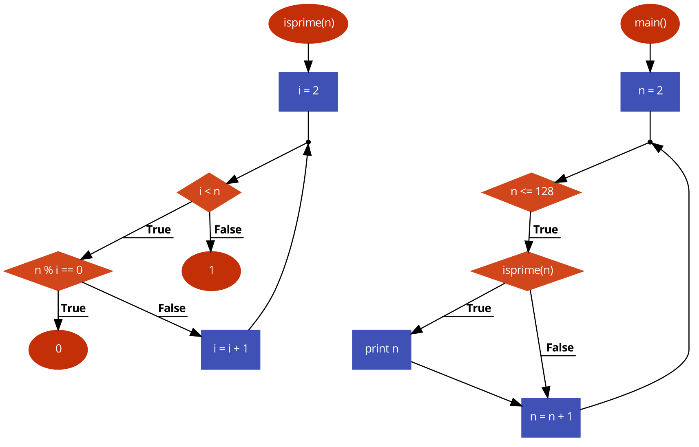
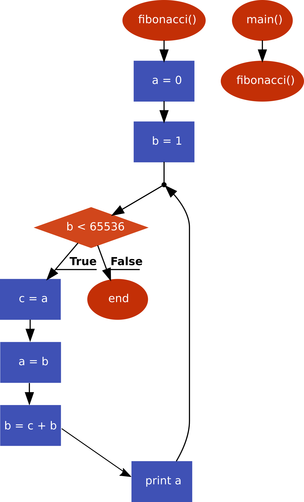
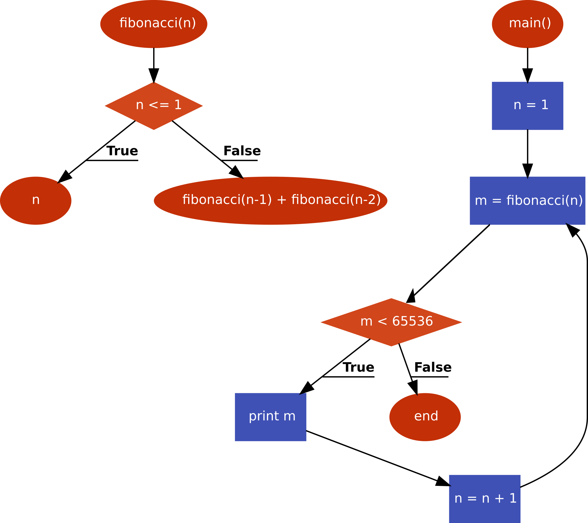

特別実験　レポート
==================

<div align="right">1AS 石田 岳志</div>

# はじめに
小型プロセッサ構造の知識を身につけるため、簡単なアルゴリズムをアセンブリ言語で作成し、動作を考察した。併せて、既に習得しているマイコンの構造を基礎に、商用の主流CPUの構成と処理の流れを理解した。

# 実験内容
実験として以下の2つのプログラムをアセンブリ言語で記述した。
* 1から128までの素数を出力するプログラム
* 65535を超えない範囲までのフィボナッチ数列を出力するプログラム
また、フィボナッチ数列を出力するプログラムは、反復型と再帰型それぞれの手法で記述し、速度を比較した。

# 1から128までの素数を出力する
1から128までの素数を出力するプログラムを実装した。

## アルゴリズムの解説
1は単数であるため、2から128までの素数を探索している。
とし、それぞれのについてそれが素数であるかどうかを`isprime(n)`で判定している。  
`isprime(n)`では、とし、を割り切れるが存在しなければは素数であると判定している。

フローチャートを図1に示す。

<figure>

<figcaption>図1 1から128までの素数を発見する手順</figcaption>
</figure>

## ソースコード

```asm
    .text                       # text section where code goes
    .globl    isprime

isprime:
    pushq    %rbp               # function prologue
    movq    %rsp, %rbp
    movl    %edi, -20(%rbp)
    movl    $2, -4(%rbp)        # i = 2
    jmp    .L2
.L5:
    movl    -20(%rbp), %eax     # jump to .L3 if if n % i != 0
    cltd
    idivl    -4(%rbp)
    testl    %edx, %edx
    jne    .L3
    movl    $0, %eax            # return 0 otherwise
    jmp    .L4
.L3:
    addl    $1, -4(%rbp)        # i = i + 1
.L2:
    movl    -4(%rbp), %eax      # jump to L5 if i < n
    cmpl    -20(%rbp), %eax
    jl    .L5
    movl    $1, %eax            # return 1 otherwise
.L4:
    popq    %rbp
    ret

    .section    .rodata         # define string as read-only data
.LC0:
    .string    "%3d is prime\n"

    .text
    .globl    main
main:
    pushq    %rbp               # function prologue
    movq    %rsp, %rbp
    subq    $16, %rsp           # reserve 16 bytes for local variables
    movl    $2, -4(%rbp)        # n = 2
    jmp    .L7
.L9:
    movl    -4(%rbp), %eax      # call isprime(n)
    movl    %eax, %edi
    call    isprime
    testl    %eax, %eax         # if isprime(n) == 0 goto .L8
    je    .L8
    movl    -4(%rbp), %esi      # print n otherwise
    movl    $.LC0, %edi
    movl    $0, %eax
    call    printf
.L8:
    addl    $1, -4(%rbp)        # n = n + 1
.L7:
    cmpl    $128, -4(%rbp)      # jump to .L9 if n <= 128
    jle    .L9
    movl    $0, %eax
    leave
    ret
```

特徴としてはスタックフレームを作ることで関数呼び出しを行っていることだが、アルゴリズムの実装という意味では直截的な書き方をしている。

## 実行結果

```
master $./a.out 
  2 is prime
  3 is prime
  5 is prime
  7 is prime
 11 is prime
 13 is prime
 17 is prime
 19 is prime
 23 is prime
 29 is prime
 31 is prime
 37 is prime
 41 is prime
 43 is prime
 47 is prime
 53 is prime
 59 is prime
 61 is prime
 67 is prime
 71 is prime
 73 is prime
 79 is prime
 83 is prime
 89 is prime
 97 is prime
101 is prime
103 is prime
107 is prime
109 is prime
113 is prime
127 is prime
```

正しく素数が出力されていることがわかる。


# 反復型アルゴリズムによるフィボナッチ数列の生成

## アルゴリズムの解説
解説のため、まずはPythonによる実装を示す。

```py
N = 65536

a, b = 0, 1

while(b < N):
    a, b = b, a + b
    print(a)
```

n番目のフィボナッチ数は


\begin{align*}
    F_0 &= 0  \\
    F_1 &= 1  \\
    F_n &= F_{n-1}+F_{n-2}
\end{align*}


で定義される。
n番目のiterationにおいて、`a`と`b`がそれぞれ


\begin{align*}
a &= F_{n-2} \\
b &= F_{n-1}
\end{align*}


という値を示していたとすると、`a, b = b, a + b`を実行することで`a`と`b`それぞれに


\begin{align*}
    a &= F_{n-1} \\
    b &= F_{n} = F_{n-1} + F_{n-2} 
\end{align*}


という値が設定され、フィボナッチ数列が生成されていく仕組みになっている。

表1はこの手法によってフィボナッチ数列が生成されていく過程を表している。

| iteration | a   | b   |
|:----------|:----|:----|
| 0         | 0   | 1   |
| 1         | 1   | 1   |
| 2         | 1   | 2   |
| 3         | 2   | 3   |
| 4         | 3   | 5   |
| 5         | 5   | 8   |
| 6         | 8   | 13  |
| 7         | 13  | 21  |
| 8         | 21  | 34  |
| ...       | ... | ... |

<figcaption>表1 反復型アルゴリズムによって生成されるフィボナッチ数列<br />
aとbはそれぞれコード内の変数を表している。
</figcaption>

<figure>

<figcaption>図2 フィボナッチ数列を生成する反復型アルゴリズム</figcaption>
</figure>


アセンブリによる実装を示す。

```asm
    .globl    main

    .section    .rodata      # define string as read-only data
.LC0:
    .string    "%d\n"

# suffix "l" denotes 32-bit integer
    .text                    # text section where code goes

fibonacci:
    pushq    %rbp
    movq    %rsp, %rbp
    subq    $32, %rsp        # reserve 32 bytes on stack for local variables
    movl    $0, -4(%rbp)     # a = 0
    movl    $1, -8(%rbp)     # b = 1
    jmp    .L2

.L3:
    movl    -4(%rbp), %eax
    movl    %eax, -12(%rbp)  # c = a
    movl    -8(%rbp), %eax
    movl    %eax, -4(%rbp)   # a = b
    movl    -12(%rbp), %eax
    addl    %eax, -8(%rbp)   # b = c + b
    movl    -4(%rbp), %esi   # argument of printf. this prints `a`
    movl    $.LC0, %edi      # "%d\n"
    call    printf

.L2:
    # return if 65536 > -8(%rbp)
    cmpl    $65536, -8(%rbp)
    jl    .L3
    nop
    leave
    ret

main:
    pushq    %rbp            # function prologue
    movq    %rsp, %rbp
    call    fibonacci       # call fibonacci
    movl    $0, %eax
    popq    %rbp
    ret
```

Pythonのように一度に変数を交換することはできないため、変数`c`(実際には`-12(%rbp)`に確保された領域)を用意し、

```
c = a
a = b
b = c + b
```

と記述している。

## 実行結果

```
$./a.out
1
1
2
3
5
8
13
21
34
55
89
144
233
377
610
987
1597
2584
4181
6765
10946
17711
28657
46368
```

65536より小さいフィボナッチ数が順番に出力されている。


# 再帰型アルゴリズムによるフィボナッチ数列の生成
## アルゴリズムの解説
フィボナッチ数列の定義


\begin{align*}
    F_0 = 0  \\
    F_1 = 1  \\
    F_n = F_{n-1}+F_{n-2}
\end{align*}


をそのまま実装したのがこのアルゴリズムである。フローチャートを図3に示す。

<figure>

<figcaption>図3 フィボナッチ数列を生成する再帰型アルゴリズム</figcaption>
</figure>

関数`fibonacci(n)`内で`fibonacci(n-1)`と`fibonacci(n-2)`を計算し、値を足しあわせている。

Pythonによる実装を示す。

```py
from itertools import count


def fibonacci(n):
    return n if n <= 1 else fibonacci(n-1) + fibonacci(n-2)


for n in count(start=1, step=1):
    m = fibonacci(n)
    if m >= 65536:
        break
    print(m)
```

`count(start=1, step=1)`は1以上の整数を順番に生成する関数である。


アセンブリによる実装を示す。

```asm
    .text
fibonacci:
    pushq    %rbp
    movq    %rsp, %rbp
    pushq    %rbx
    subq    $24, %rsp         # reserve 24 bytes for local variables
    movl    %edi, -20(%rbp)   # jump to .L2 if n > 1
    cmpl    $1, -20(%rbp)
    jg    .L2
    movl    -20(%rbp), %eax   # return otherwise
    jmp    .L3
.L2:
    movl    -20(%rbp), %edi   # call fibonacci(n-1)
    subl    $1, %edi
    call    fibonacci
    movl    %eax, %ebx
    movl    -20(%rbp), %eax   # call fibonacci(n-2)
    subl    $2, %eax
    movl    %eax, %edi
    call    fibonacci
    addl    %ebx, %eax        # fibonacci(n-1) + fibonacci(n-2)
.L3:
    addq    $24, %rsp         # free the reserved space and return
    popq    %rbx
    popq    %rbp
    ret

    .section    .rodata
.LC0:
    .string    "%d\n"

    .text
    .globl    main
main:
    pushq    %rbp
    movq    %rsp, %rbp
    subq    $16, %rsp         # reserve 16 bytes for local variables
    movl    $1, -4(%rbp)      # n = 1
.L7:
    # .L7 is an infinite loop
    movl    -4(%rbp), %edi
    call    fibonacci         # m = fibonacci(n)
    movl    %eax, -8(%rbp)
    cmpl    $65535, -8(%rbp)  # break if m > 65535
    jg    .L10
    movl    -8(%rbp), %esi    # print m
    movl    $.LC0, %edi
    call    printf
    addl    $1, -4(%rbp)      # n = n + 1
    jmp    .L7
.L10:
    movl    $0, %eax
    leave
    ret
```

`%eax`に格納されれた`fibonacci(n-1)`の返り値を`%ebx`に確保しておき、`fibonacci(n-2)`の戻り値に加算している。

実行結果を示す。

```
$./a.out
1
1
2
3
5
8
13
21
34
55
89
144
233
377
610
987
1597
2584
4181
6765
10946
17711
28657
46368
```

65536より小さいフィボナッチ数が順番に出力されている。

# 速度比較
反復型アルゴリズムと再帰型アルゴリズムによるフィボナッチ数列の計算速度を比較した。

## 比較方法
45番目のフィボナッチ数である1134903170を計算するのにかかる時間を比較した。
速度比較に用いたコードを示す。


```asm
# fibonacci_recursive_benchmark.s
	.text
fibonacci_recursive_:
	pushq	%rbp
	movq	%rsp, %rbp
	pushq	%rbx
	subq	$24, %rsp         # reserve 24 bytes for local variables
	movl	%edi, -20(%rbp)
	cmpl	$1, -20(%rbp)     # jump to .L2 if n > 1
	jg	.L2
	movl	-20(%rbp), %eax   # return otherwise
	jmp	.L3
.L2:
	movl	-20(%rbp), %edi   # call fibonacci_recursive_(n-1)
	subl	$1, %edi
	call	fibonacci_recursive_
	movl	%eax, %ebx
	movl	-20(%rbp), %eax   # call fibonacci_recursive_(n-2)
	subl	$2, %eax
	movl	%eax, %edi
	call	fibonacci_recursive_
	addl	%ebx, %eax        # fibonacci_recursive_(n-1) + fibonacci_recursive_(n-2)
.L3:
	addq	$24, %rsp         # free the reserved space and return
	popq	%rbx
	popq	%rbp
	ret

	.text
	.globl	fibonacci_recursive
fibonacci_recursive:
	pushq	%rbp
	movq	%rsp, %rbp
	movl	$45, %edi
	call	fibonacci_recursive_         # m = fibonacci_recursive_(n)
	leave
	ret
```

```asm
# fibonacci_iterative_benchmark.s
# suffix "l" denotes 32-bit integer
    .global fibonacci_iterative
    .text   # text section where code goes

fibonacci_iterative:
	pushq	%rbp
	movq	%rsp, %rbp
	subq	$32, %rsp        # reserve 32 bytes on stack for local variables
	movl	$0, -4(%rbp)     # -4(%rbp) = 0
	movl	$1, -8(%rbp)     # -8(%rbp) = 1
	jmp	.L2

.L3:
	movl	-4(%rbp), %eax
	movl	%eax, -12(%rbp)  # -12(%rbp) = -4(%rbp)
	movl	-8(%rbp), %eax
	movl	%eax, -4(%rbp)   # -4(%rbp) = -8(%rbp)
	movl	-12(%rbp), %eax
	addl	%eax, -8(%rbp)   # -8(%rbp) = -12(%rbp) + -8(%rbp)
.L2:
    # return if 1134903170 >= -8(%rbp)
	cmpl	$1134903170, -8(%rbp)
	jle	.L3
	nop
	leave
	ret
```

```c
// benchmark_template.c
#include <stdio.h>
#include <sys/time.h>

extern void fibonacci_iterative();
extern void fibonacci_recursive();

long timediff_microseconds(struct timeval end_time, struct timeval start_time) {
    return (end_time.tv_sec - start_time.tv_sec) * 1000000L +
            end_time.tv_usec - start_time.tv_usec;
}

int main() {
    struct timeval start_time, end_time;
    const int n_iterative_executions = 100000000;

    gettimeofday(&start_time, NULL);
    for(int i = 0; i < n_iterative_executions; i++) {
        fibonacci_iterative();
    }
    gettimeofday(&end_time, NULL);
    printf("Iterative: %ld microseconds / %d times\n",
           timediff_microseconds(end_time, start_time), n_iterative_executions);

    gettimeofday(&start_time, NULL);
    fibonacci_recursive();
    gettimeofday(&end_time, NULL);
    printf("Recursive: %ld microseconds\n",
            timediff_microseconds(end_time, start_time));
    return 0;
}
```

反復型アルゴリズムのほうが再帰型アルゴリズムよりはるかに高速に計算できたため、反復型アルゴリズムのみを1億回繰り返し実行し、1回の実行にかかった平均時間を計算している。

## 結果

計測結果を表2に示す。

| アルゴリズム | 実行時間 [μs] |
|:-------------|:--------------|
| 反復型       | 0.12255103    |
| 再帰型       | 8808216       |

<figcaption>表2 実行時間の計測結果</figcaption>

## 考察
再帰型は計算に無駄が多い。例えば`fibonacci(6)`の値を求めるときは次のような計算を行っている。

```
fibonacci(6)
= fibonacci(5) + fibonacci(4)

= fibonacci(4) + fibonacci(3) +
  fibonacci(3) + fibonacci(2)

= fibonacci(3) + fibonacci(2) +
  fibonacci(2) + fibonacci(1) +
  fibonacci(2) + fibonacci(1) +
  fibonacci(1) + fibonacci(0)

= fibonacci(2) + fibonacci(1) +
  fibonacci(1) + fibonacci(0) +
  fibonacci(1) + fibonacci(0) +
  1 +
  fibonacci(1) + fibonacci(0) +
  1 + 1 + 1

= fibonacci(1) + fibonacci(0) +
  1 + 1 + 1 + 1 + 1 + 1 + 1 + 1
= 1 + 1 + 1 + 2 + 2 + 1 + 2 + 1 + 2
= 2 + 1 + 2 + 3 + 3 + 2
= 3 + 2 + 3 + 5
= 5 + 3 + 5
= 8 + 5
= 13
```

例えば`fibonacci(2)`は一度計算すればその値が定まるにも関わらず、一度の実行の中で5回も計算を行っている。このように、再帰型のアルゴリズムでフィボナッチ数を計算するとロスが大きくなる。引数の値に応じて再帰の"枝"の数も指数関数的に大きくなっていくため、計算量も指数関数的に増加してしまう。

一方で反復型は、表1で示したようにn番目のフィボナッチ数をn回のステップで求めることができるため、再帰型よりも圧倒的に高速である。

### 解決方法
再帰型アルゴリズムの計算を高速化するにはメモ化という手法が有効である。これは一度呼んだ関数の戻り値を記憶しておくことで、再度同じ条件で関数を呼び出した際にキャッシュされている値を参照することで無駄な計算を省く手法である。

一度計算した値をキャッシュしておけば計算を高速化できる。

例えば先ほどの`fibonacci(6)`の計算においても`fibonacci(2)`を呼んだ際にその戻り値を記憶しておけば計算量を格段に減らすことができる。


```
fibonacci(6)
= fibonacci(5) + fibonacci(4)

= fibonacci(4) + fibonacci(3) +
  fibonacci(3) + fibonacci(2)

= fibonacci(3) + fibonacci(2) +
  fibonacci(2) + fibonacci(1)   # fibonacci(3)
  fibonacci(3) +
  fibonacci(1) + fibonacci(0)   # fibonacci(2)

= fibonacci(3) + fibonacci(2) +
  fibonacci(2) + fibonacci(1)   # fibonacci(3)
  fibonacci(3) +
  1 + 1   # fibonacci(2)

# fibonacci(2) = 2 が求まったのでfibonacci(2)を全て2で置き換える
= fibonacci(3) + 2 +
  2 + 1   # fibonacci(3)
  fibonacci(3) +
  2

# fibonacci(3) = 3 が求まったのでfibonacci(3)を全て3で置き換える
= 3 + 2 + 3 + 3 + 2
= 5 + 3 + 3 + 2
= 8 + 5
= 13
```

Pythonの標準ライブラリにはメモ化のためのdecoratorが含まれているため、簡単にメモ化を使うことができる。

```py
import timeit

print("Without cache")

setup = """
def fibonacci(n):
    if n < 2:
        return n
    return fibonacci(n-1) + fibonacci(n-2)
"""

t = timeit.timeit("fibonacci(32)", setup, number=10)
print("time: " + str(t))


print("With cache")

setup = """
from functools import lru_cache as cache

@cache(maxsize=None)
def fibonacci(n):
    if n < 2:
        return n
    return fibonacci(n-1) + fibonacci(n-2)
"""

t = timeit.timeit("fibonacci(32)", setup, number=10)
print("time: " + str(t))
```

```
$python3 fibonacci.py
Without cache
time: 9.575860627999646
With cache
time: 2.311699790880084e-05
```

`fibonacci(32)`を計算すると、メモ化を使ったもののほうが40万倍以上も速い。
